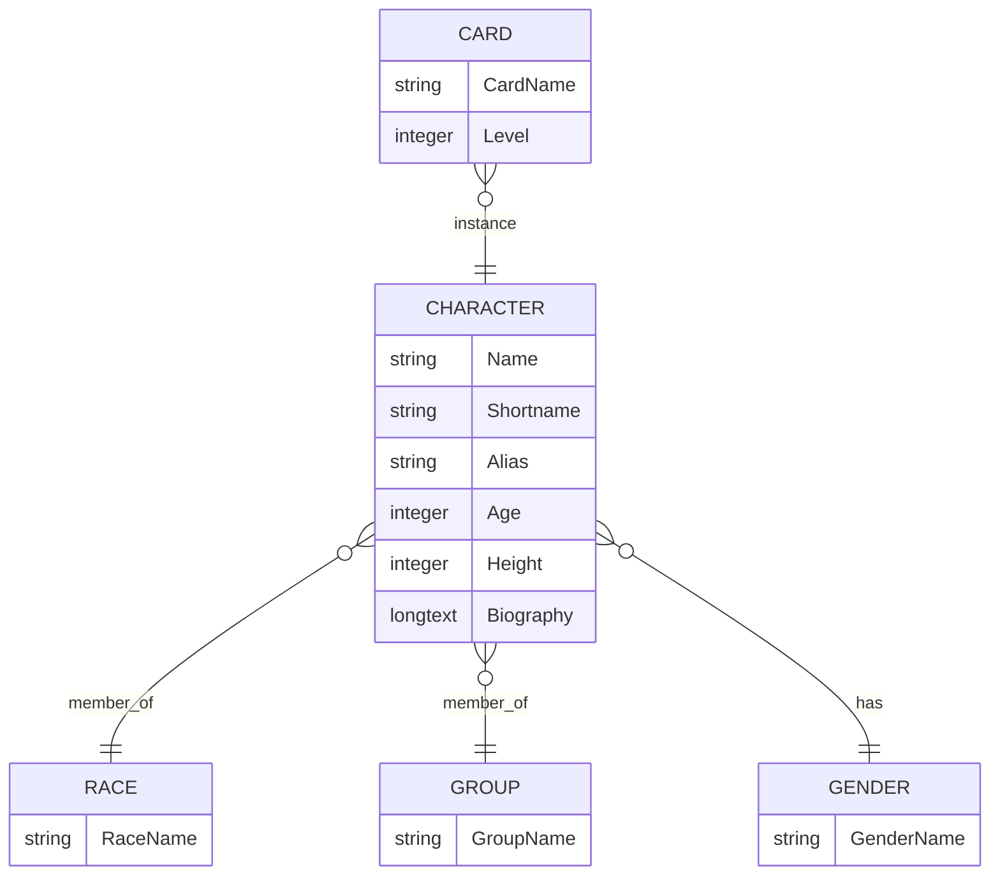

# Data model

This is the current roadmap. Not all parts of this are in the application yet.

```mermaid
erDiagram
	CARD }o--|| CHARACTER: instance
	CHARACTER }o--|| RACE: member_of
	CHARACTER }o--|| GROUP: member_of
	CHARACTER }o--|| GENDER: has
	CARD {
		string CardName
		integer Level
	}
	CHARACTER {
		string Name
		string Shortname
		string Alias
		integer Age
		integer Height
		longtext Biography
	}
	GENDER {
		string GenderName
	}
	GROUP {
		string GroupName
	}
	RACE {
		string RaceName
	}
```
